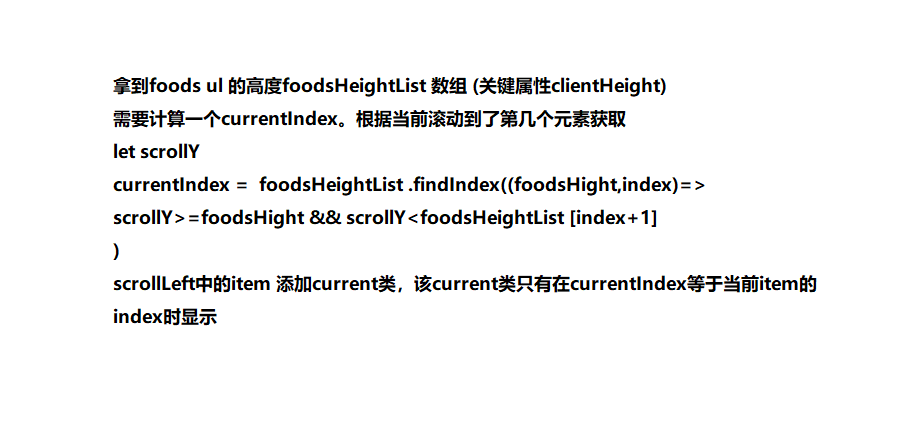

# vue-project-waimai

## 使用vuex
store文件夹下建立如下文件

* state.js
* mutations.js
* actions.js
* getters.js

按如下顺序编写四个文件。

1. state

2. actions

   > actions是一个包含多个回调函数的对象。

   > 每个回调函数的第一个参数是一个`object`,从里面可以拿到state对象和  commit方法。
   >
   > 在这里拿到的state，我们一般只进行读操作 

   > commit方法用于向mutation提交要进行的修改操作以及要修改的数据。commit的调用时机决定了修改state的时机。因此可以异步调用commit达到异步修改state目的。

3. mutations

    mutations是一个包含多个回调函数的对象。

    每个回调函数的第一个参数是state,第二个参数是action传过来的数据

    mutations是同步执行的

4. getters

四个文件都向外暴露一个对象。


## Vue.prototype.$store.dispatch

接受参数

1. `actionName:string`

   与actionName对应的action会被调用

2. `rest`

   剩余参数会被传入的对应的action中


`_`,`$`开头的属性不被vue代理


## 直接访问某个子路由，静态引入的文件失效

由于采用的是broswer的路由，页面中的相对路径的计算都是根据当前地址栏中的url计算的。直接访问2+级路由会导致路径的计算错误。

好习惯：

index.html页面中引入静态资源时使用绝对路径。

## mockjs 
坑
Mock.mock(/api\/goods/,{code:0,data:goods})
好习惯：
第一个参数应该传入正则表达式。

## betterScroll使用
```js
this.rightScroll = new BScroll(this.$refs.right, {
    click: true, // 分发click事件
    probeType: 1  // 非实时 触摸
    // probeType: 2  // 实时 触摸
    // probeType: 3  // 实时 触摸/惯性/编码
})
```

## 右侧跟随左侧滑动




## 向响应式对象中添加一个属性
Vue.set( target, propertyName/index, value )
参数：

{Object | Array} target
{string | number} propertyName/index
{any} value
返回值：设置的值。

用法：

向响应式对象中添加一个属性，并确保这个新属性同样是响应式的，且触发视图更新。它必须用于向响应式对象上添加新属性，因为 Vue 无法探测普通的新增属性 (比如 this.myObject.newProperty = 'hi')


## 更新状态数据
子组件更新父组件状态数据：父组件传递函数。
父组件更新子组件状态数据：父组件通过refs拿到子组件引用，调用子组件的相关方法。

## 图片懒加载
vue-lazyload

## Vue无法响应 delete操作，Map/Set数据结构

## BetterScroll必须在组件的页面显示后才能正确的将逻辑注入到DOM中
推广 ：很多需要传入DOM节点后才能初始化的插件，最好都在vm.$nextTick的回调中进行初始化。

## 下nextTick的主要应用的场景及原因。

在Vue生命周期的created()钩子函数进行的DOM操作一定要放在Vue.nextTick()的回调函数中

在created()钩子函数执行的时候DOM 其实并未进行任何渲染，而此时进行DOM操作无异于徒劳，所以此处一定要将DOM操作的js代码放进Vue.nextTick()的回调函数中。与之对应的就是mounted()钩子函数，因为该钩子函数执行时所有的DOM挂载和渲染都已完成，此时在该钩子函数中进行任何DOM操作都不会有问题 。

**在数据变化后要执行的某个操作，而这个操作需要使用随数据改变而改变的DOM结构的时候，这个操作都应该放进Vue.nextTick()的回调函数中。**

作者：R
链接：https://juejin.im/post/5a6fdb846fb9a01cc0268618
来源：掘金
著作权归作者所有。商业转载请联系作者获得授权，非商业转载请注明出处。

## 路由守卫的使用
Foods的leftScroll和rightScroll初始化需要等到goods请求完成后进行。
我们可以监听goods的变化，等到goods发生改变后再进行初始化。
goods在访问/shop这个路由的时侯请求。
直接访问/shop/foods时，goods确实会变化一次。
但是请求foods的兄弟路由时，goods已经请求到了。此时切换到foods时，goods并不会变化，导致没有scroll的初始化。
解决方法：使用路由守卫，
每次访问/shop/foods时，先检查是不是从兄弟路由跳过来的。如果是，那么在next方法中初始化。

## inline-block 想要撑开父容器的宽度，那么父容器也用inline-block
