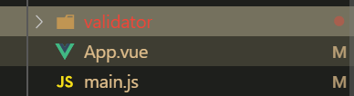

# 搭建环境



main.js

全局注册ValidationProvider组件

```js
import { ValidationProvider } from 'vee-validate';
import './validator'
Vue.component("ValidationProvider",ValidationProvider)
```

validator.js

引入extend函数定义校验规则

```js
import { extend } from 'vee-validate';

extend('phone', {
  validate: (value) => {
    if (!value.startsWith('1')) {
        //可以在validate中返回一个字符串，表示校验失败
      return '手机号必须以1开头';
    }
    // 测试通过
    return /^1[3456789]\d{9}$/.test(value);
  },
    //校验失败时调用message返回失败消息
  message(/**...args */){
    /**
      console.log(args) 
      参数
      0: "{field}"
      1: {max: undefined, _field_: "{field}", _value_: "1321233333", _rule_: "phone"}
     * 
     */
    return '手机号不正确'
  }
});


```

使用内置校验规则[参照链接](https://logaretm.github.io/vee-validate/guide/basic-validation.html#importing-validation-rules)

内置邮箱验证

```js
import { required,email,max} from 'vee-validate/dist/rules';

extend('email',{
  ...email, //email 是一个对象 包含 params和validate两个字段
  message:()=>{
    return "邮箱验证失败"
  }
})
```


```js
<ValidationProvider rules="email"  v-slot="{ errors }"
  class="validator"
  name="email"
>
    <input
      class="form-control txtbox"
      v-model="email"
      placeholder="邮箱"
     />
  <span     
     style="color: red;"
     class="msg-err">{{ errors[0] }}</span>
</ValidationProvider>

```


打印多个不满足的验证消息

---

验证失败不会中断后继规则的验证,指定：bails="false"

```vue
<ValidationProvider rules="min:3|numeric" v-slot="{ errors }" :bails="false">
  <input v-model="value" type="text">
  <ul>
    <li v-for="error in errors">{{ error }}</li>
  </ul>
</ValidationProvider>
```


###### **指定message中的`_field_`插值模板的值**

---

给`ValidationProvider`指定name属性

在message中使用{_field_}获取

```js
extend('email',{
  ...email,
  message:'{_field_}不是一个合法的邮箱'
})
```


###### 统一校验

---

使用ValidationObserver

```js
<ValidationObserver v-slot="{ valid }">
  <ValidationProvider
    rules="required"
    v-slot="{ errors }"
  >
    <input type="text" v-model="name">
    <span>{{ errors[0] }}</span>

  </ValidationProvider>

  <ValidationProvider
    rules="required|email"
    v-slot="{ errors }"
  >
    <input type="text" v-model="email">
    <span>{{ errors[0] }}</span>

  </ValidationProvider>

  <button :disabled="!valid">Submit</button>
</ValidationObserver>
```

